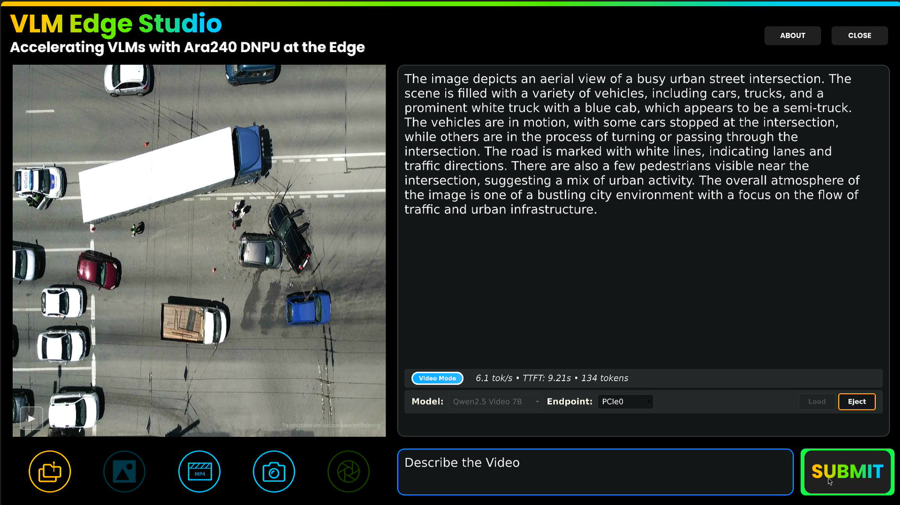

<div align="center">

# VLM Edge Studio 🚀

[](./LICENSE)
[](https://www.nxp.com/products/processors-and-microcontrollers/arm-processors/i-mx-applications-processors:IMX_HOME)
[](https://isocpp.org/)
[](https://www.nxp.com/docs/en/user-guide/UG10166.pdf)
[]()
[](https://www.nxp.com/design/design-center/software/embedded-software/i-mx-software/embedded-linux-for-i-mx-applications-processors:IMXLINUX)

---

</div>

## 🔎 Overview

Introducing **VLM Edge Studio**: the NXP launcher designed for supported _Visual Language Models_ (VLMs) accelerated by the Ara240 DNPU at the edge. This application, compatible with FRDM i.MX 95 and FRDM i.MX 8M Plus, enables rapid interaction with locally running VLMs. It uses the eIQ AAF Connector to communicate with the Ara240 Runtime SDK and provides a user-friendly GUI for model selection and prompt input.

```mermaid
graph LR
    subgraph FRDM_iMX["**FRDM i.MX Platform (Host)**"]
        subgraph VLM_Studio["**VLM Edge Studio**"]
            UI["GUI<br/>Model Selector & Prompt Input"]
            Client["eIQ AAF Connector<br/>(HTTP Client)"]
        end

        subgraph AAF_Server["**eIQ AAF Connector**"]
            API["REST API Server"]
            Optimum["Optimum Ara"]
        end
        subgraph proxy["**Ara240 Runtime SDK**"]
            LB["Proxy"]
        end
    end

    subgraph Accelerator["**Ara240 DNPU**"]
        Model["Loaded VLM<br/>(model.dvm)"]
    end

    %% Application Layer Connections
    UI <--> Client
    Client -->|HTTP POST/GET| API

    %% Server Layer Connections
    API -->|SSE Stream| Client
    API -->|Prompt| Optimum
    Optimum <-->|socket| proxy

    %% Hardware Communication
    proxy <-->|PCIe / USB| Model

    %% Response Flow
    Optimum -.->|Streaming Tokens| API

    linkStyle default stroke: #FF7400, stroke-width: 2px;

    style FRDM_iMX fill:#EBE7DD,stroke:#262626,color:#262626
    style Accelerator fill:#EBE7DD,stroke:#262626,color:#262626
    style VLM_Studio fill:#HEX #262626,stroke:#000000,color:#F7F5F1
    style AAF_Server fill:#HEX #262626,stroke:#000000,color:#F7F5F1
    style proxy fill:#HEX #262626,stroke:#000000,color:#F7F5F1

    style UI fill:#F9B500,stroke:#262626,color:#262626
    style Client fill:#69CA00,stroke:#262626,color:#262626
    style API fill:#69CA00,stroke:#262626,color:#262626
    style Optimum fill:#0EAFE0,stroke:#262626,color:#262626
    style Model fill:#FFD800,stroke:#262626,color:#262626
    style LB fill:#F7F5F1,stroke:#262626,color:#262626
```



## 💻 Supported Platforms

| Platform                                                                                                    | Supported |
| ----------------------------------------------------------------------------------------------------------- | :-------: |
| [FRDM i.MX 8M Plus](https://www.nxp.com/design/design-center/development-boards-and-designs/FRDM-IMX8MPLUS) |     ✅     |
| [FRDM i.MX 95](https://www.nxp.com/design/design-center/development-boards-and-designs/FRDM-IMX95)          |     ✅     |

## 📋 Requirements

### Required hardware 🧰

- Supported FRDM i.MX platform
- microSD (recommended >=64 GB)
- Ara240 DNPU
- Power supply (5V/3A recommended)
- 1920x1080 Display monitor
- HDMI cable
- USB Mouse & Keyboard
- USB-C debug cable
- USB-C HD Camera (1920x1080 @ 30fps recommended)
- Internet (For Model installation)

### 💻 Software

- Ara240 Runtime SDK installed on target
- [Embedded Linux for i.MX](https://www.nxp.com/design/design-center/software/embedded-software/i-mx-software/embedded-linux-for-i-mx-applications-processors:IMXLINUX) (>= LF6.18.2_1.0.0)
- eIQ AAF Connector v2.0.0
- `nxp/Qwen2.5-VL-7B-Instruct-Ara240` (model.dvm)
- [vlm-edge-studio.deb](https://www.nxp.com/webapp/sps/download/license.jsp?colCode=VLM-EDGE-STUDIO_1.0.0&appType=file1&DOWNLOAD_ID=null) (optional, build instructions available in this repository)

## 🧠 Currently supported VLMs

| **Model**           | **Params (billion)** | **TTFT (s)** | **Avg. Token rate (Tokens/seconds)** | **Model Card**                                                                            | **License**                                                                             |
| ------------------- | -------------------- | ------------ | ------- | ----------------------------------------------------------------------------------------- | --------------------------------------------------------------------------------------- |
| Qwen2.5-VL-7B  | 7B                 | 1 - 14.26         | 6.255     | [nxp/Qwen2.5-VL-7B-Instruct-Ara240](https://huggingface.co/nxp/Qwen2.5-VL-7B-Instruct-Ara240) | [Apache-2.0](https://huggingface.co/nxp/Qwen2.5-VL-7B-Instruct-Ara240/blob/main/LICENSE) |

> **Note:**\
> **TTFT:** - Time to first token (TTFT). Reported as a range: the lower bound corresponds to prompts up to 128 tokens, and the upper bound reflects prompts at maximum context length.\
> **Avg. Token Rate:** Average token rate over the context length.

## ⚙️ Build `vlm-edge-studio.deb` package

1. Clone the repository on your host PC:

    ```bash
    git clone https://github.com/nxp-imx-support/vlm-edge-studio.git
    ```

2. Change directory to the repository and run the following command. Make sure you have the NXP toolchain installed for the FRDM BSP version you need. Steps to build the toolchain are available at [iMX Linux User's Guide](https://www.nxp.com/docs/en/user-guide/UG10163.pdf).

    ```bash
    bash build.sh <path_to_your_toolchain>
    ```

## 🧰 Installation on i.MX

**NOTE:** Make sure the Ara240 Runtime SDK is installed in the FRDM i.MX system before moving forward.

1. Copy the `vlm-edge-studio.deb` to the FRDM i.MX board:

   ```bash
   scp vlm-edge-studio.deb root@<ip_addr>:
   ```

2. Install the package with the following command. This will take a couple of minutes mainly because models need to be extracted:

   ```bash
   dpkg -i vlm-edge-studio.deb
   ```

**NOTE:** If you downloaded the pre-built `.deb` package from NXP.COM, the package name will includes the version. Use the actual package name in the command above. `dpkg -i vlm-edge-studio-<version>.deb`.


## 🚀 Run VLM Edge Studio

1. Run the following command:

    ```
    run_vlm_edge_studio
    ```

    > **NOTE:** Make sure Ara240's runtime service is up and running. You can check with this command: `systemctl status rt-sdk-ara2.service --no-pager -l`

2. Once the launcher is showed in the screen, click on the `LOAD` button. The model will start to load; once ready, you can prompt the LLM and submit.

<center>
<br>
<br><i>Figure 1. VLM Edge Studio.</i>
</center>


## Limitations

A single instance of the program **cannot run multiple models simultaneously across different endpoints**. Model selection is limited to one per instance, regardless of the number of endpoints available.


### UI not rendered correctly in higher resolution monitors

The application has been designed for 1920x1080 (FHD) resolution and has not yet been updated to support higher resolutions. Since it lacks dynamic resizing, certain UI elements may appear misaligned. As a workaround you can force Weston to use FHD by modifying the `/etc/xdg/weston.ini` script and restart the Weston service:

```plain
[output]
#name=HDMI-A-1
mode=1920x1080@60
#transform=rotate-90
```

### Board Reboots Running Inference

If your board reboots when submitting a prompt for inference, the issue may be related to insufficient power supply Ensure that the power source you're using is the correct one.

> **WARN:** Using a lower-rated power supply may cause system instability or unexpected reboots during high-load operations such as inference.

---

## 🛣️ Roadmap

Support for running multiple models on separate endpoints within a single instance is under consideration for future releases. This enhancement would enable more flexible and scalable deployments, especially in multi-endpoint environments.


## ⚖️ Licensing

This repository is licensed under the [LA_OPT_Online Code Hosting NXP_Software_License](./LICENSE.txt) license.